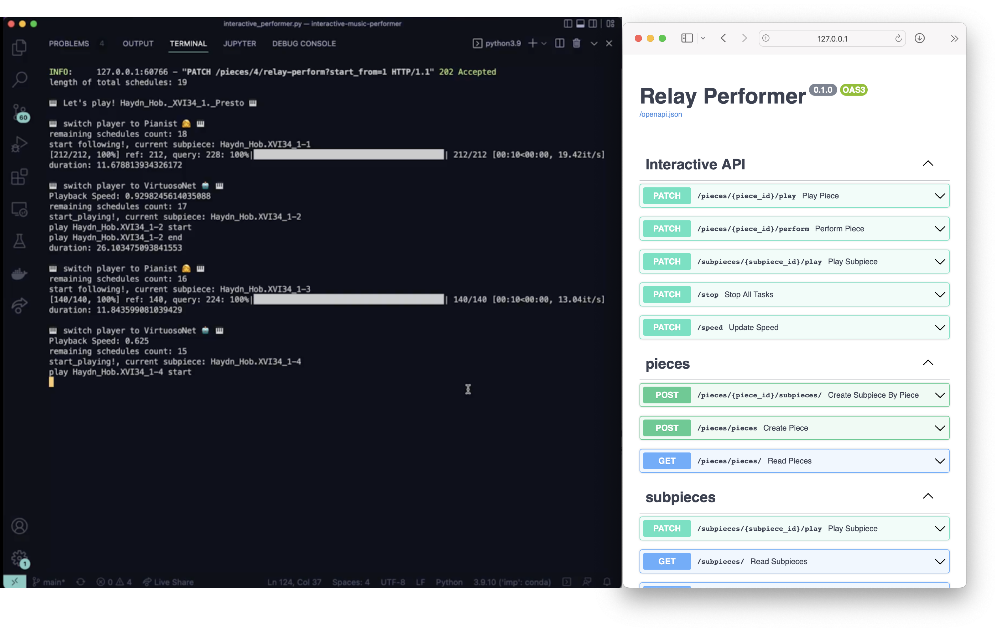

# Relay Performer

Relay Performer is an interactive music performance system which enables relay performance between human pianist & AI pianist. It requires MIDI port connection (eg. Disklavier) and uses built-in audio device for real-time stream processing.
The online time warping (OLTW) algorithm is implemented in this system, based on the paper [MATCH: A MUSIC ALIGNMENT TOOL CHEST](http://www.cp.jku.at/research/papers/dixon_ismir_2005.pdf) by Simon Dixon published at ISMIR2005.


Tested on Python 3.10 (conda)

## Preparing packages

```bash
$ brew install redis
$ brew services start redis
```

## Setting a new conda environment

If you're using Mac M1, please run the following command before creating a new conda environment.

```bash
$ brew install portaudio
$ brew --prefix portaudio # copy the path
$ vim $HOME/.pydistutils.cfg

# Then, add the following lines to the file.

[build_ext]
include_dirs=/--PATH--/include/
library_dirs=/--PATH--/lib/
```

Create a new conda environment and activate it.

```bash
$ conda env create -f environment.yml
$ conda activate rpf
```

- If there's an issue about `soundfile`, please reinstall soundfile as follows:

    ```bash
    $ pip install --upgrade --force-reinstall soundfile
    ```

## Rebuild DB & Start App

```bash
# rebuild db
$ sqlite3 ./sql_app.db < initial_data.sql

# start app
$ uvicorn app.main:app --reload
```



- To test APIs, go to `127.0.0.1:8000`, which redirects to `127.0.0.1:8000/docs`.
- To manage admin dashboard, go to `127.0.0.1:8000/admin`.
